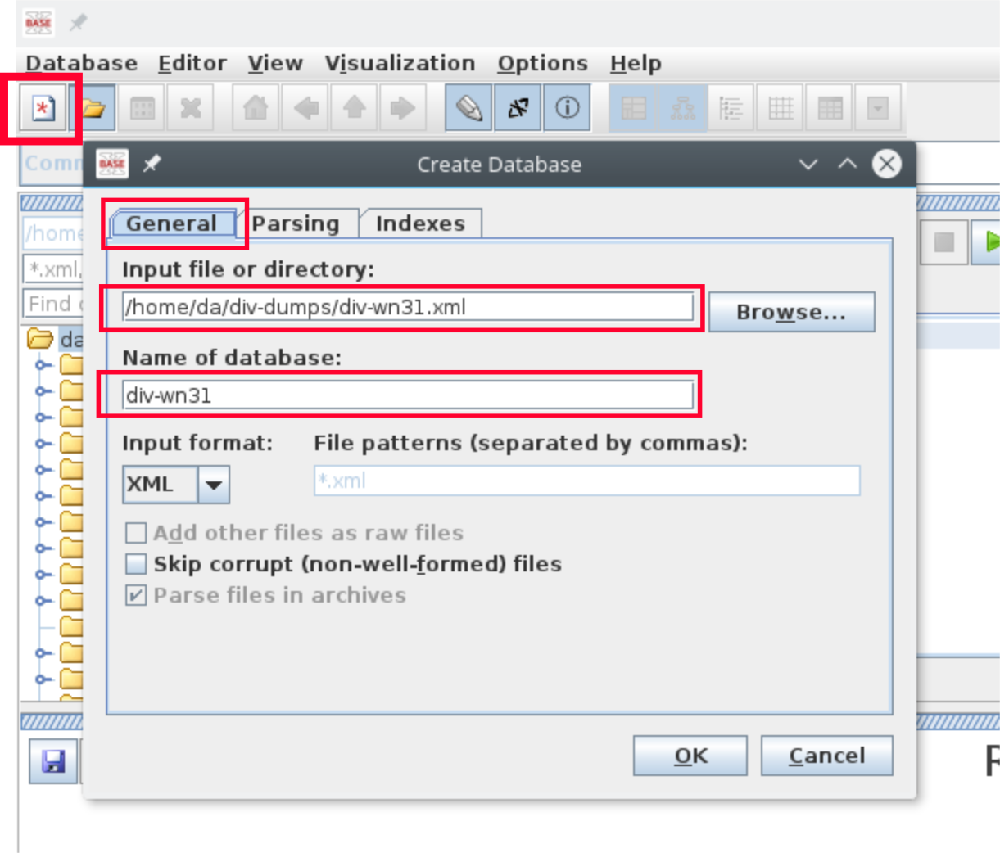
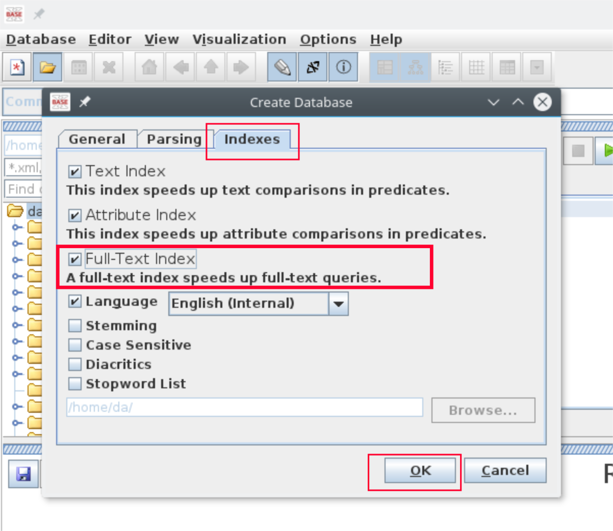

For preprocessing and quering XMLs we suggest [BaseX](#basex) database, while for browsing H2 SQL databases you can use the included [H2](#h2) server. A better tool for db management could be [SquirrelSQL](#squirrel-sql)


### BaseX 

If you need to browse large XMLs or update them for some preprocessing before importing them into Diversicon, <a href="http://basex.org/" target="_blank">BaseX</a> db could be a good choice. For some common tasks, we already provide scripts in `$exec{eu.kidf.diversicon.cli.DiverCli.SCRIPTS_XML_PATH}`

For example, supposing you:

1) installed <a href="http://basex.org/products/download/all-downloads/" target="_blank">BaseX</a>
2) `basex` executable is on your path
3) want to rename prefixes of an XML

From DiverCli installation directory you coud run a command like this:

```

basex -bold-prefix=sm -bnew-prefix=mysm -bin-file=lexres/smartphones.xml  -o my-smartphones.xml  scripts/rename-prefixes.xql

```
**NOTE**: this script is just an example, to replace everything you will still have to fix manually the xmlns: with the new prefix !

Here we show how to load the <a href="http://diversicon-kb.eu/dataset/diversicon-wordnet-31/resource/xml" target="_blank">Diversicon Wordnet 3.1 XML</a>:

Click on new database and the panel that pops up, put this in `General` tab: 



In `Indexes` tab check `Full-text`:



 Then press OK, you should see a screen like this:


### H2

To browse H2 databases, you can use `H2` own browsing tool. It is included in DiverCLI distribution under `bin/h2` directory. 
 

To run it on Linux / Mac:

```bash 

cd bin/h2/bin

./h2.sh

```

On Windows:

```bash

cd bin/h2/bin

h2.bat

```


This should open a browser pointed at a screen like the following, where we try to connect to a <a href="http://diversicon-kb.eu/dataset/diversicon-wordnet-31/resource/h2db" target="_blank">Diversicon Wordnet H2 DB</a> : 


If you put the correct db url, you should see a panel like this, with all the tables listed in the left panel:


 

If you put the wrong url, probably h2 will create a new empty database at that url and you will see this panel:
 

 
 
### Squirrel SQL 

<a href="http://squirrel-sql.sourceforge.net" target="_blank"> Squirrel SQL</a> has lots of features, although sometimes UI might look a bit confusing.


 
Before connecting to the database, you need to tell Squirrel where the H2 driver is. You can find
 H2 binary jar inside the DiverCLI distribution, and configure Squirrel like this:
 


Afterwards, you can proceed defining an alias to a database. For example, here we are using 
the <a href="http://diversicon-kb.eu/dataset/diversicon-wordnet-31/resource/h2db" target="_blank"> h2 database Wordnet 3.1 </a> downloaded from Diversicon website:


Then you are ready to connect:


 
 
 